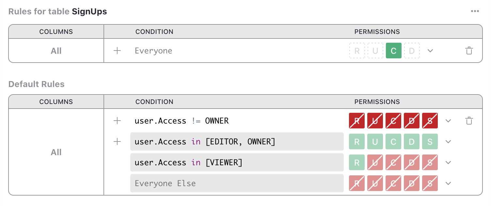

# Grist Form Submit

> Scripts to turn form submissions on webpages into new records in Grist documents.

This repo contains tools to make it easy to submit forms as new records added to
[Grist](https://www.getgrist.com) documents.

- [Setting up Grist docs](#setting-up-grist-docs)
- [Plain HTML forms](#plain-html-forms)
- [Javascript submit handlers](#javascript-submit-handlers)
- [WordPress Contact Form 7](#wordpress-contact-form-7)
- [Troubleshooting](#troubleshooting)

## Setting up Grist docs

For all of the methods below, you'll need to set up a Grist document that can receive submissions.
This part of the instructions is the same for all of the methods.

1. Create or select a Grist document to hold the submissions. You'll need its URL later.

2. Add the table and columns to hold the submitted data. Note the table ID for later.

   In Grist, table IDs are generated from table names to make them valid identifiers for use in
   code. Usually, you can guess the table ID by replacing any spaces in the table name with
   underscores (`_`). If in doubt, look at [Raw Data](https://support.getgrist.com/raw-data/#raw-data-page)
   page of your document, which lists all table IDs.

3. Note the column IDs of the columns to be populated.

   Like table IDs, Grist column IDs are generated from labels (read more
   [here](https://support.getgrist.com/col-types/#renaming-columns)).
   You can see the IDs of the selected column at the top of the
   [creator panel](https://support.getgrist.com/glossary/#creator-panel)'s `Column` tab.

   A handy place to see all column IDs (and table IDs too!) in your Grist document is in the
   `Code View` page, available from the left-side panel.

   It's important to spell form field names the same way as Grist column IDs, including
   lowercase/uppercase differences, and the use of underscore (`_`) rather than dash (`-`), since
   dash isn't allowed in Grist column IDs.

   For fields with multiple values (such as same-named checkboxes, which may be used to populate a
   ChoiceList column), add a pair of empty square brackets to the name of HTML form field (e.g.
   `foo[]`).

4. You'll need to allow submissions to your document. This requires opening up access to allow
   modifying the document by anonymous users (those submitting the form), and using
   Access Rules to limit anonymous access to a single privilege: adding records to your selected
   table.

   1. Start by creating the Access Rules. Click on `Access Rules` in the left panel.
   2. In the "Default Rules" section, add a rule with condition `user.Access != OWNER`, and
      permisison "Deny All" (it should show as all 5 red boxes).

   3. Click "Add Table Rules" and select your table to hold submissions. Keep the default empty
      condition (which means "Everyone"), and click the "Create" permission (`C`) twice to make it green
      (i.e. allowed).

      Your rules should look like this (where instead of "SignUps", you'll see the name of your table):

      

   4. Now open the Share menu, and click Manage Users.
      Turn [Public access](https://support.getgrist.com/sharing/#public-access-and-link-sharing)
      to "On", and
      set Public Access role to `Editor`. Your screen should look like this:

      

      Click "Confirm".

      Don't worry, the rules in the previous step will not allow the public to see anything in your
      doc, only to create records in one table. But just in case, you should confirm by opening
      your document in a private window. There should be no error opening it, but it should look
      empty.

## Plain HTML forms

Somewhere in your page, include the following script snippet:

```html
<script src="https://gristlabs.github.io/grist-form-submit/grist-form-submit.js"></script>
```

Add the following attributes to the `<form>` tag that contains your HTML form:
- `data-grist-doc="DOC_URL"`, replacing `DOC_URL` with the Grist document URL from
  step 1 of the setup instructions.
- `data-grist-table="TABLE_ID"`, replacing `TABLE_ID` with the table ID from step 2.
- `data-grist-success-url="URL"`, replacing `URL` with the URL you want the user redirected to if
  the submission is successful.

That's all! Remember to name the fields in the form according to the column IDs into which they
should go. See details about Grist column IDs in step 3 above.


## Javascript submit handlers

Somewhere in your page, include the following script snippet:

```html
<script src="https://gristlabs.github.io/grist-form-submit/grist-form-submit.js"></script>
```

This makes available `gristFormSubmit()` global function available, which you can use in your
own Javascript handler:

```
gristFormSubmit(gristDocUrl, gristTableId, formData)
```
- `gristDocUrl` should be the URL of the Grist document, from step 1 of the setup instructions.
- `gristTableId` should be the table ID from step 2.
- `formData` should be a [FormData](https://developer.mozilla.org/en-US/docs/Web/API/FormData)
  object, typically obtained as `new FormData(formElement)`. Inside the `submit` event handler, it
  can be convenient to use `new FormData(event.target)`.

This function sends values from `formData` to add a new record in the specified Grist table. It
returns a promise for the result of the
[add-record API call](https://support.getgrist.com/api/#tag/records/paths/~1docs~1%7BdocId%7D~1tables~1%7BtableId%7D~1records/post). In case of an error, the promise will be rejected with an error message.

Remember to name the fields in your form (as visible in `formData`) according to the column IDs
into which they should go. See details about Grist column IDs in step 3 of the Grist setup
instructions.


## WordPress Contact Form 7

[Contact Form 7](https://wordpress.org/plugins/contact-form-7/) is a WordPress plugin for a simple
flexible contact forms. It doesn't have built-in functionality to save submissions to a
database. This script makes it easy to save submissions as Grist records.

Start by configuring your Grist document using [instructions above](#setting-up-grist-docs).

Then configure your Contact Form 7 form in WordPress. Remember that the names of input fields must
correspond to Grist column IDs. Step 3 of the instructions above explains it further.

Now add the following snippet at the end of your Contact Form 7 template:

```html
<script src="https://gristlabs.github.io/grist-form-submit/grist-form-submit.js"
  data-grist-doc="GRIST_DOC_URL"
  data-grist-table="GRIST_TABLE_ID"
></script>
```

replacing `GRIST_DOC_URL` with the URL of the document from step 1 of the setup instructions, and
`GRIST_TABLE_ID` with the table ID from step 2.

Save the form, and test it.

## Troubleshooting

If you don't see a record appearing in your table, open the browser script console to see error
messages. Those should tell you enough about the problem to know which step above to double-check.

Typical problems will include lack of access (revisit step 4 of setup instructions), or mismatched
column IDs (revisit step 3). If you are still having trouble, please open an issue in this repo,
or ask in the [Grist Community Forum](https://community.getgrist.com).
