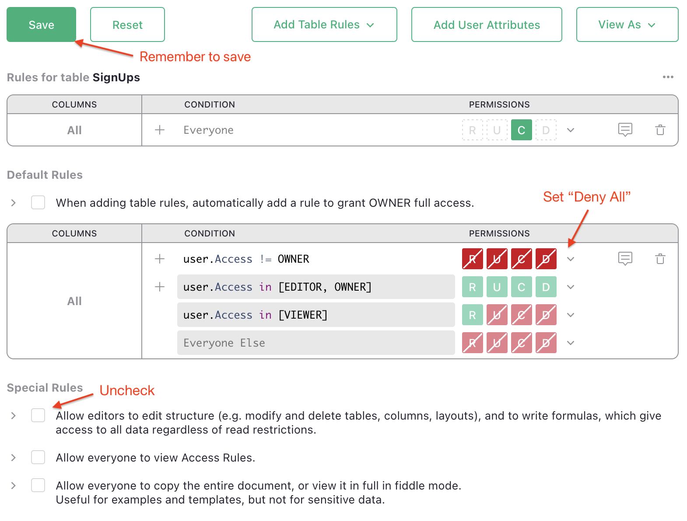

# Grist Form Submit

> Scripts to turn form submissions on webpages into new records in Grist documents.

This repo contains tools to make it easy to submit forms as new records added to
[Grist](https://www.getgrist.com) documents.

## WordPress Contact Form 7

[Contact Form 7](https://wordpress.org/plugins/contact-form-7/) is a WordPress plugin for a simple
flexible contact forms. It doesn't have built-in functionality to save submissions to a
database. This script makes it easy to save submissions as Grist records.

Instructions:

1. Create or select a Grist document to hold the submissions. You'll need its URL for step 5.

2. Add the table and columns to hold the submitted data. Note the table ID for step 5.

   In Grist, table IDs are generated from table names to make them valid identifiers for use in
   code. Usually, you can guess the table ID by replacing any spaces in the table name with
   underscores (`_`). If in doubt, look at [Raw Data](https://support.getgrist.com/raw-data/#raw-data-page)
   page of your document, which lists all table IDs.

3. You'll need to allow submissions to your document. This requires opening up access to allow
   modifying the document by anonymous users (those submitting the form), and using
   Access Rules to limit anonymous access to a single privilege: adding records to your selected
   table.

   1. Start by creating the Access Rules. Click on `Access Rules` in the left panel.
   2. In the "Default Rules" section, add a rule with condition `user.Access != OWNER`, and
      permisison "Deny All" (it should show as all 5 red boxes).

   3. Click "Add Table Rules" and select your table to hold submissions. Keep the default empty
      condition (which means "Everyone"), and click the "Create" permission (`C`) twice to make it green
      (i.e. allowed).

      Your rules should look like this (where instead of "SignUps", you'll see the name of your table):

      

   4. Now open the Share menu, and click Manage Users.
      Turn [Public access](https://support.getgrist.com/sharing/#public-access-and-link-sharing)
      to "On", and
      set Public Access role to `Editor`. Your screen should look like this:

      

      Click "Confirm".

      Don't worry, the rules in the previous step will not allow the public to see anything in your
      doc, only to create records in one table. But just in case, you should confirm by opening
      your document in a private window. There should be no error opening it, but it should look
      empty.

4. Configure your Contact Form 7 form in WordPress. The names of input fields must correspond to
   Grist column IDs.

   Note that in Grist, column IDs are also generated from labels (read more
   [here](https://support.getgrist.com/col-types/#renaming-columns)).
   You can see the IDs of the selected column at the top of the
   [creator panel](https://support.getgrist.com/glossary/#creator-panel)'s `Column` tab.

   It's important to spell Contact Form 7 field names the same way as Grist column IDs, including
   lowercase/uppercase differences, and the use of underscore (`_`) rather than dash (`-`), since
   dash isn't allowed in Grist column IDs.

5. Finally, add the following snippet at the end of your Contact Form 7 template:

   ```html
   <script src="https://gristlabs.github.io/grist-form-submit/grist_wpcf7.js"
     data-grist-doc="GRIST_DOC_URL"
     data-grist-table="GRIST_TABLE_ID"
   ></script>
   ```

   replacing `GRIST_DOC_URL` with the URL of the document from step 1, and
   `GRIST_TABLE_ID` with the table ID from step 2.

6. Save the form, and test it. If you don't see a record appearing in your table, open the browser
   script console to see error messages. Those should tell you enough about the problem to know
   which step above to double-check.

Typical problems will include lack of access (revisit step 3), or mismatched column IDs (revisit
step 4). If you are still having trouble, please open an issue here, or ask in the [Grist Community
Forum](https://community.getgrist.com).
